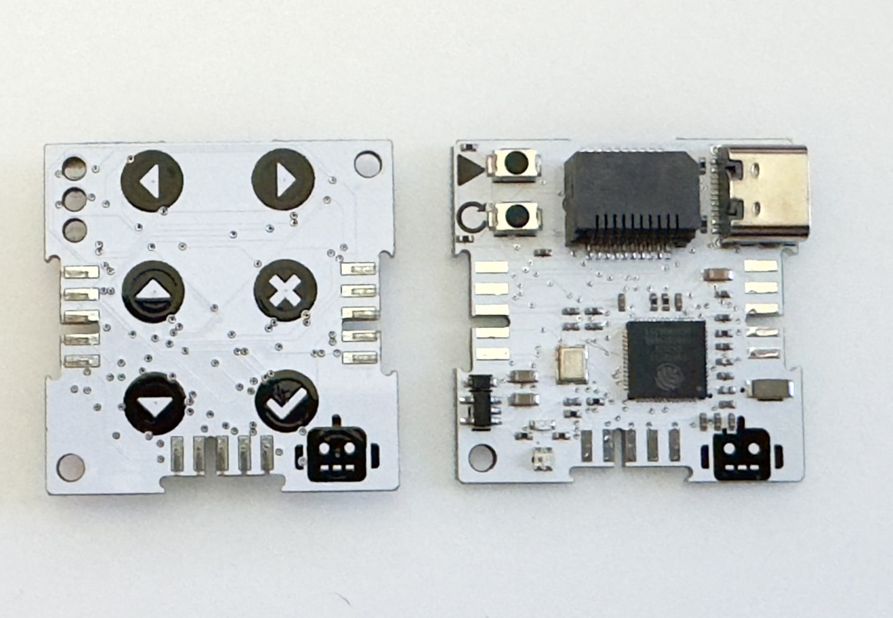

# CWA Core WiFi Standard
This is the default core used in the Domino4 eco-system.

## Main ChipSet

The core is built around the ESP32 series from Espressif:
- Version 1: Uses the standard ESP32 [ESP32-WROOM-32](https://www.espressif.com/sites/default/files/documentation/esp32-wroom-32_datasheet_en.pdf)
- Version 2+: Uses the ESP32-S3 [ESP32-S3(FN8)](https://www.espressif.com/sites/default/files/documentation/esp32-s3_datasheet_en.pdf)

## Programming

### Programming in Arduino

#### Version 1:
- To program the Domino4 cores using Arduino, install the board files using the doumentation from [Espressif](https://github.com/espressif/arduino-esp32)
- Please read the notes regarding upload/transfer speed when using the [PPU](https://github.com/domino4com/PPU).
- Settings:
  - **Board:** Choose the ```ESP32 Dev Module```
  - **Speed:** Max 460800 bps
  - **Port:** Chose the port where your PPU is inserted. If you cannot see the port, the check out your [PPU installation](https://github.com/domino4com/PPU)

### Programming in Python.
- Download the MicroPython firmware from [micropython.org](https://micropython.org/download/esp32/)
- It is recommended to download and use the (Mu Editor)(https://codewith.mu/en/download)
- You can use the Mu Editor to upload the MicroPython Firmware.

## Pin Usage
### Buttons 
#### Touch Buttons - Only V1
| Symbol | GPIO | T# |
|:-----------------------------:|:----:|:--:|
| :arrow_left:                  | IO13 | T4|
| :arrow_right:                 | IO15 | T3|
| :arrow_up:                    | IO12 | T5|
| :arrow_down:                  | IO27 | T7|
| :white_check_mark:            | IO4  | T0|
| :negative_squared_cross_mark: | IO14 | T6|
| :robot:                       | IO33 | T8|
#### Push Buttons - V2+
| Symbol | GPIO | Function |
|:-----------------------------:|:----:|:--:|
| :arrow_forward:                 | IO0 | Program |
| :arrows_counterclockwise:               | n/a | Reset |

### LEDs
#### V1
| Postion | Color | GPIO | On when|
|:-----------------------------|:----:|:--:|:--:
|  Top |Red| IO25 | Low |
|  Top |Blue| IO26 | Low |
|  Middle |Yellow| IO19 | High |
|  Bottom |Red| IO17 | Low |
|  Bottom |Green| IO18 | Low |

#### V2+
| Postion | Color | GPIO | On when|
|:-----------------------------|:----:|:--:|:--:
|  Top |Red| IO40 | High |
|  Bottom |RGB| IO39 | Neopixel |

### Other Pins
| Function |  GPIO V1 |GPIO V2+ | Notes|
|:-----------------------------|:----:|:----:|:--|
|  I²C SDA |21|17||
|  I²C SCL |22|18 ||
|  Serial TX |1|43 ||
|  Serial RX |3|44 ||
|  IO pin |2|1 |When used for capacitative sensing, refer to T2|
| DblTap |n/a|2|

### Expansion port (V2+ only)
| SPI |  GPIO | MMC | 
|:-----------------------------|:----:|:--|
|  MISO |38|DAT0|
|  MOSI |37|CMD |
|  SCK  |36|CLK |
|  X1   |35|DAT3 |
|  X2   |34|DAT1 |
|  X3   |33|DAT2 |

## Troubleshooting
- If you try to upload code and getting this message ```A fatal error occurred: Timed out waiting for packet content``` or ```A fatal error occurred: Invalid head of packet (0xE0)```, change the transfer speed to 460800 pbs.
- If you try to upload code and getting this message ```[7886] Failed to execute script esptool the selected serial port [7886] Failed to execute script esptool
does not exist or your board is not connected```, your serial port is open by another application. Close the other application and try again.

# License: 

Creative Commons Attribution-NonCommercial-ShareAlike 4.0 International Public License

[View License Deed](https://creativecommons.org/licenses/by-nc-sa/4.0/) | [View Legal Code](https://creativecommons.org/licenses/by-nc-sa/4.0/legalcode)

